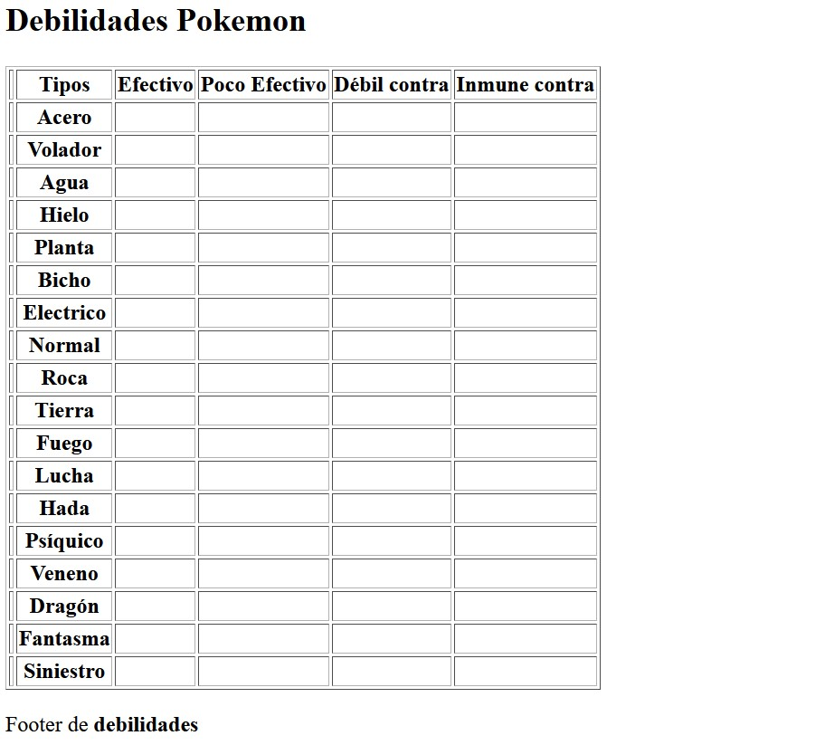

## Actividad Clase tabla con pure HTML

a) Haciendo uso de HTML, construye los siguientes documentos:

#### Tabla 1

### Tabla 2

b) Escribe los atajos Emmet para la generación de los dos documentos anteriores.

Ejemplo:
header > p > strong{Header}
table > tr * 3 > td * 4
