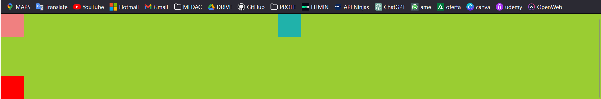
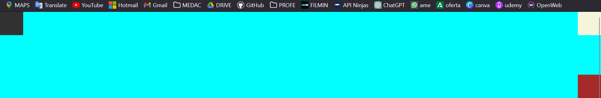
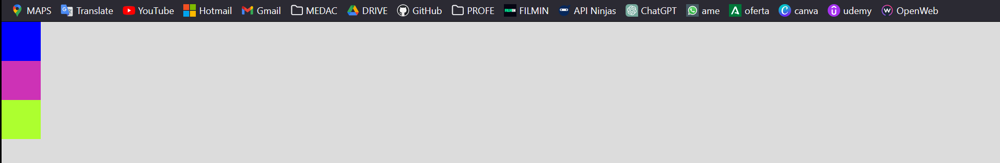
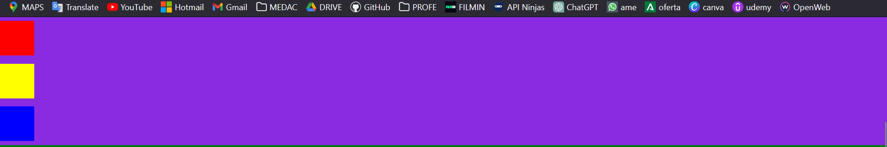
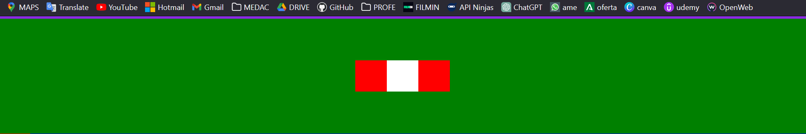
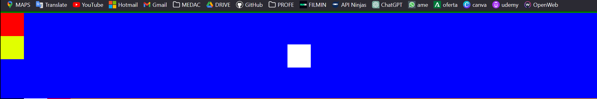
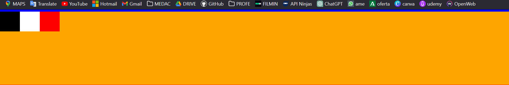
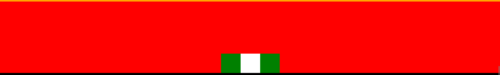
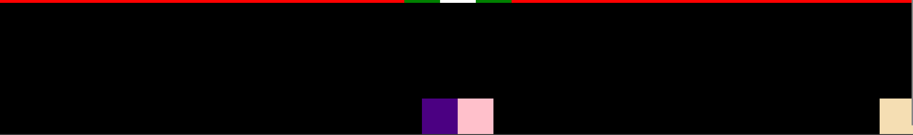

## Display y Position

##### Haciendo uso de los atributos display y/o position, posiciona los elementos para que se vean como en la imagen.

***Notas***
- En el ejercicio se da un **index.html** y un **styles.css** con una serie de clases CSS dentro.  
- El *html* tiene una serie de *\<section>* con 3 *\
* cada uno. Esos *divs* tienen forma de caja de 50px por 50px y un color particular cada uno para su correcta identificación.
- Para resolver los ejercicios no hace falta cambiar el *html*.
- Podéis identificar el section y las cajas sobre las que tenéis que actuar por los colores.

**EJEMPLO RESUELTO**
1. Haciendo uso de los atributos display y/o position, sitúa las cajas en las posiciones que se ven en la imagen.

    /\*Linea de Ejemplo\*/  
    .main__section--ejemplo {  
    background-color: yellowgreen;  
    }  

    .section__caja--ejemplo-0 {  
     position: absolute;  
    bottom: 0;  
    background-color: red;  
    }  
    .section__caja--ejemplo-1 {  
    position: absolute;  
    top: 0;  
    background-color: lightcoral ;  
    }  
    .section__caja--ejemplo-2 {  
    position: absolute;  
    top: 0;  
    right: 50%;  
    background-color: lightseagreen;  
    }  

**EJERCICIOS**
##### Haciendo uso de los atributos display y/o position, sitúa las cajas en las posiciones que se ven en la imagen.

1. 
2. 
3. 
4. 
5. 
6. 
7. 
8. 
