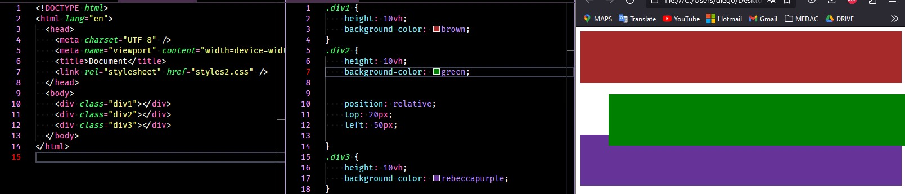
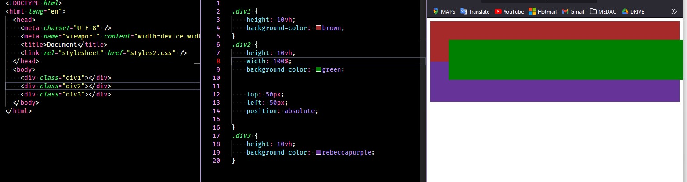

# Atributo Position
### Conceptos principales sobre el atributo CSS position

*¿Qué valores puede tomar el atributo **position**?*

static | relative | sticky | absolute | fixed

El atributo ***"position"*** en CSS se utiliza para controlar cómo se posiciona un elemento en una página web en relación con otros elementos. Hay varios valores que puedes usar para el atributo *"position"* pero los cuatro más comunes son:

- **static**: Es el valor predeterminado. Los elementos con *position: static* se colocan en el flujo normal del documento, uno después del otro, según el orden en el código HTML. No se ven afectados por las propiedades "top," "right," "bottom" o "left.", es decir, por defecto esos elementos quedan *estáticos* en su posición original.

- **relative**: Cuando un elemento tiene *position: relative;*, puedes usar las propiedades "top," "right," "bottom" y "left" para moverlo en relación con su posición original en el flujo normal del documento. Esto no afecta la posición de otros elementos en la página.  
**IMPORTANTE:**  
    - El elemento se mueve DESDE SU posición original
    - El hueco que deja desde su posición original queda ahí, los demás elementos no se reorganizan.

- **absolute**:  Los elementos con *position: absolute;* se posicionan con respecto a su elemento padre más cercano que tenga una posición distinta de "static." Puedes usar las propiedades "top," "right," "bottom" y "left" para especificar su ubicación exacta en relación con ese elemento padre.  
**IMPORTANTE**  
    - Se posicionan CON RESPECTO AL PADRE con position diferente a static más cercano.
    - Toman como referencia LA POSICIÓN ORIGINAL del padre con *position* diferente a static más cercana.
    - Dejan de formar parte del flujo normal de posicionamiento de los elementos. Dejan su hueco libre para ser ocupado por otros elementos.
    - Ten en cuenta que el elemento SALE DEL FLUJO NORMAL DE POSICIONAMIENTO del documento a todos los efectos. Por defecto no va a tener ni height ni width.
    - El primer elemento padre con *position* diferente a static es **\<body>**

- **fixed**: Los elementos con *position: fixed;* se colocan en una ubicación específica de la ventana del navegador y permanecen allí incluso cuando se desplaza la página. Se pueden usar las propiedades "top," "right," "bottom" y "left" para definir su posición en la ventana del navegador.  
**IMPORTANTE**
    - Los elementos se posicionan con RESPECTO A LA VENTANA DEL NAVEGADOR. La ventana del navegador es esa que tienes delante de tus ojos, es como si colgaras un tapete de ganchillo encima de la pantalla.
    - Da igual si haces scroll para abajo o para arriba, ese elemento siempre va a estar posicionado con respecto A LA VENTANA DEL NAVEGADOR.